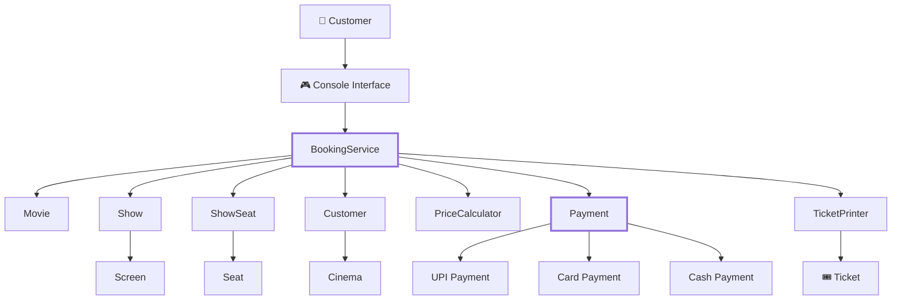
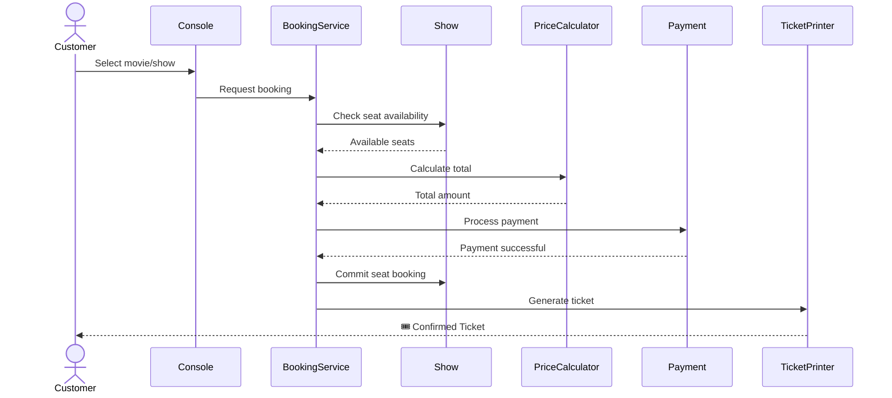
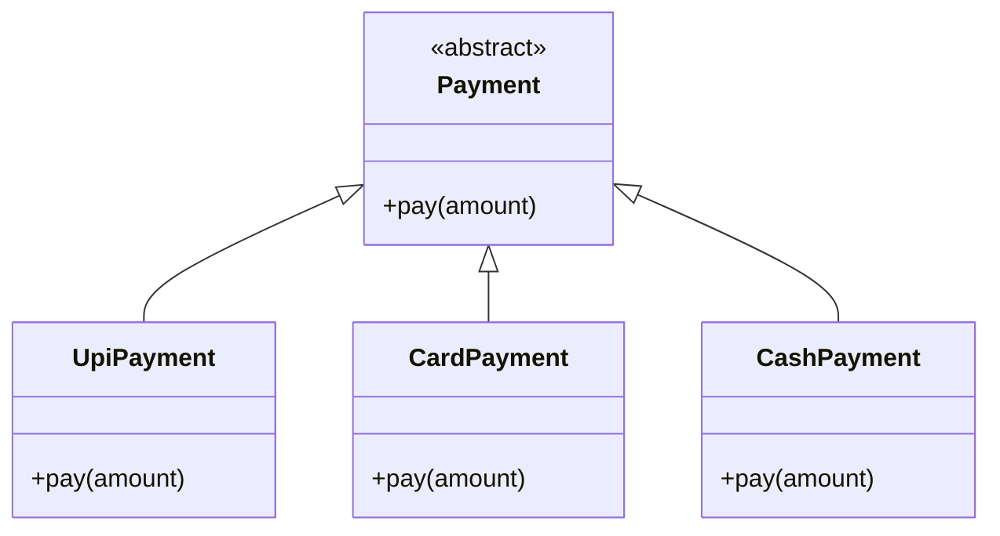

<div align="center">

# 🎬 Cinema Ticket Booking System

### **TCS-504 — Object-Oriented Programming Project**

<p>
  
  
  
  
</p>

<p>
  <b>An object-oriented console-based cinema booking system</b><br/>
  featuring dynamic seat allocation, polymorphic payments,<br/>
  transaction rollback, cancellation, and automatic ticket rendering.
</p>

<br/>

**C++17 · Object-Oriented Design · Polymorphism · SOLID · Transaction Safety**

</div>

---

## 🧭 Navigation

<table>
<tr>
<td align="center">🚀<br/><a href="#-quick-start">Quick Start</a></td>
<td align="center">🏗️<br/><a href="#%EF%B8%8F-system-architecture">Architecture</a></td>
<td align="center">🎮<br/><a href="#-interactive-demo">Demo</a></td>
<td align="center">📐<br/><a href="#-solid-design">SOLID</a></td>
<td align="center">📂<br/><a href="#-repository-structure">Structure</a></td>
<td align="center">✅<br/><a href="#-requirements">Requirements</a></td>
</tr>
</table>

---

## 🎯 Project Overview

The **Cinema Ticket Booking System** is a C++17 console application designed to demonstrate practical application of **Object-Oriented Programming principles** in a real-world booking workflow.

The system models the complete journey:

```text
Movie Selection
      ↓
Show Selection
      ↓
Seat Availability
      ↓
Seat Selection
      ↓
Dynamic Pricing
      ↓
Payment Processing
      ↓
Booking Confirmation
      ↓
Ticket Generation
```

It also handles failure scenarios such as:

* ❌ Attempting to book an unavailable seat
* ❌ Invalid seat codes
* ❌ Payment failure
* 🔄 Transaction rollback
* ↩️ Booking cancellation
* ♻️ Automatic seat restoration

---

# 🚀 Quick Start

## 1️⃣ Clone the Repository

```bash
git clone <YOUR-REPOSITORY-URL>
cd <YOUR-REPOSITORY-NAME>
```

## 2️⃣ Compile

The project uses standard **C++17**.

```bash
g++ -std=c++17 src/*.cpp -o cinema_booking
```

## 3️⃣ Run

### Linux / macOS

```bash
./cinema_booking
```

### Windows

```bash
cinema_booking.exe
```

### ⚡ One-line build + run

```bash
g++ -std=c++17 src/*.cpp -o cinema_booking && ./cinema_booking
```

> **Requirement:** Any compiler supporting C++17 can be used.

---

# 🎮 Interactive Demo

The application provides a menu-driven console interface.

```text
╔══════════════════════════════════════════╗
║       🎬 MOVIE TICKET BOOKING            ║
╠══════════════════════════════════════════╣
║  1. Movies                               ║
║  2. Book                                 ║
║  3. Cancel                               ║
║  4. My Tickets                           ║
║  0. Exit                                 ║
╚══════════════════════════════════════════╝
```

<details>
<summary><b>▶ Step 1 — Select Movie & Show</b></summary>

```text
Choose: 2

Choose movie
1. 3 Idiots

Choose: 1

[1] Screen-1 06:00 PM

Choose show: 1
```

The selected show displays its current seat availability.

</details>

<details>
<summary><b>▶ Step 2 — View Dynamic Seat Layout</b></summary>

```text
Screen-1 06:00 PM
3 Idiots

SILVER    A1[] A2[X] A3[] A4[]
GOLD      B1[] B2[] B3[X]
PLATINUM  C1[] C2[]

([] = Available    [X] = Booked)
```

The layout dynamically reflects the current booking state.

</details>

<details>
<summary><b>▶ Step 3 — Select Seats & Calculate Price</b></summary>

```text
Enter seat count: 2

Enter seat code: A1
Enter seat code: C1

TOTAL: Rs.550
```

The total is calculated according to the individual seat tiers.

```text
A1 → SILVER
C1 → PLATINUM

TOTAL → Rs.550
```

</details>

<details>
<summary><b>▶ Step 4 — Polymorphic Payment</b></summary>

```text
Pay by:
1. UPI
2. Card
3. Cash

> 1

[UPI] Rs.550 paid successfully
```

The booking service works through the abstract `Payment` interface.

</details>

<details>
<summary><b>▶ Step 5 — Ticket Generation</b></summary>

```text
================ TICKET ================

Booking ID : BK1001
Movie      : 3 Idiots
Screen     : Screen-1 06:00 PM
Seats      : A1, C1
Amount     : Rs.550
Status     : CONFIRMED

=========================================
```

</details>

<details>
<summary><b>▶ Step 6 — Booking Conflict Detection</b></summary>

Trying to book an already occupied seat:

```text
Enter seat count: 1
Enter seat code: A1

Seat A1 unavailable or invalid!
```

The system prevents double booking.

</details>

<details>
<summary><b>▶ Step 7 — Cancellation & Seat Restoration</b></summary>

```text
Choose: 3

Enter Booking ID to cancel: BK1001

Booking BK1001 cancelled successfully.
```

The previously booked seats become available again:

```text
SILVER    A1[] A2[X] A3[] A4[]
GOLD      B1[] B2[] B3[X]
PLATINUM  C1[] C2[]
```

This demonstrates **state restoration after cancellation**.

</details>

---

# 🏗️ System Architecture

The system separates responsibilities across domain entities, services, payment implementations, and output handling.



### 🔑 Central Coordinator

`BookingService` coordinates the booking workflow without owning the implementation details of individual payment methods.

```text
Customer
   │
   ▼
BookingService
   │
   ├── Movie / Show
   ├── Seat Validation
   ├── PriceCalculator
   ├── Payment Interface
   └── TicketPrinter
```

---

# 🔄 Booking Workflow



---

# 🧠 Object-Oriented Design

## Core Domain Model

| Class             | Responsibility                         |
| ----------------- | -------------------------------------- |
| `Movie`           | Stores movie information               |
| `Seat`            | Represents physical seat information   |
| `Screen`          | Represents cinema screen               |
| `Cinema`          | Represents cinema entity               |
| `Show`            | Associates movie, screen and timing    |
| `ShowSeat`        | Maintains seat availability for a show |
| `Customer`        | Stores customer information            |
| `Booking`         | Represents a booking transaction       |
| `Payment`         | Abstract payment interface             |
| `PriceCalculator` | Calculates booking amount              |
| `TicketPrinter`   | Formats ticket output                  |
| `BookingService`  | Coordinates booking operations         |

---

# 🧩 SOLID Design

<details>
<summary>1️⃣ <b>Single Responsibility Principle — SRP</b></summary>

Different responsibilities are isolated into dedicated classes.

```text
PriceCalculator
       ↓
Pricing only

TicketPrinter
       ↓
Ticket formatting only

BookingService
       ↓
Booking orchestration
```

**Relevant files**

```text
src/11_PriceCalculator.cpp
src/12_TicketPrinter.cpp
```

</details>

<details>
<summary>2️⃣ <b>Open/Closed Principle — OCP</b></summary>

Payment functionality can be extended without modifying the booking workflow.

```text
             Payment
                │
       ┌────────┼────────┐
       ▼        ▼        ▼
      UPI      Card     Cash
```

A future implementation such as:

```text
NetBankingPayment
CryptoPayment
WalletPayment
```

can extend the existing abstraction.

**Relevant files**

```text
src/09_Payment.cpp
src/10_PaymentTypes.cpp
```

</details>

<details>
<summary>3️⃣ <b>Liskov Substitution Principle — LSP</b></summary>

Concrete payment classes can be substituted wherever the base `Payment` abstraction is expected.

```cpp
Payment* payment;

payment = new UpiPayment();
payment = new CardPayment();
payment = new CashPayment();
```

Each implementation follows the same payment contract.

**Relevant file**

```text
src/10_PaymentTypes.cpp
```

</details>

<details>
<summary>4️⃣ <b>Interface Segregation Principle — ISP</b></summary>

Entity classes expose focused operations rather than unnecessary interfaces.

The domain model is divided across specific entities:

```text
Movie
Seat
Screen
Show
Customer
Booking
```

rather than creating one oversized interface.

**Relevant files**

```text
src/01_Movie.cpp
src/02_Seat.cpp
src/03_Screen.cpp
src/04_Cinema.cpp
src/05_Show.cpp
src/06_ShowSeat.cpp
src/07_Customer.cpp
src/08_Booking.cpp
```

</details>

<details>
<summary>5️⃣ <b>Dependency Inversion Principle — DIP</b></summary>

`BookingService` depends on the abstraction:

```cpp
Payment
```

rather than directly depending on:

```cpp
UpiPayment
CardPayment
CashPayment
```

Conceptually:

```text
          BookingService
                 │
                 ▼
          <<abstract>>
             Payment
          /     |     \
         /      |      \
       UPI     Card    Cash
```

**Relevant file**

```text
src/13_BookingService.cpp
```

</details>

---

# 🔐 Transaction Safety

One of the important features is **atomic multi-seat booking**.

Suppose the user requests:

```text
A1
A3
C1
```

The system should not partially commit the booking if one requested seat becomes invalid.

### Conceptual transaction

```text
Validate ALL seats
       │
       ▼
All available?
   ┌───┴───┐
  YES      NO
   │        │
   ▼        ▼
Calculate   Reject
Price       booking
   │
   ▼
Payment
   │
 ┌─┴─┐
YES  NO
 │    │
 ▼    ▼
Commit Rollback
 │
 ▼
Ticket
```

This prevents inconsistent seat states.

---

# 💰 Dynamic Pricing

Pricing is calculated based on the selected seat tier.

```text
┌─────────────┬────────────────┐
│ Tier        │ Pricing        │
├─────────────┼────────────────┤
│ SILVER      │ Tier-based     │
│ GOLD        │ Tier-based     │
│ PLATINUM    │ Tier-based     │
└─────────────┴────────────────┘
```

For example:

```text
A1 → SILVER
C1 → PLATINUM
      ↓
PriceCalculator
      ↓
TOTAL = Rs.550
```

The pricing responsibility remains isolated from booking and payment logic.

---

# 💳 Payment Architecture



### Current Payment Methods

| Method  | Implementation |
| ------- | -------------- |
| 🟣 UPI  | `UpiPayment`   |
| 💳 Card | `CardPayment`  |
| 💵 Cash | `CashPayment`  |

---

# 📂 Repository Structure

```text
.
├── README.md
├── LICENSE
│
├── docs/
│   ├── 01_REQUIREMENTS.md
│   ├── 02_NOUN_VERB_ANALYSIS.md
│   ├── 03_CLASS_DESIGN.md
│   ├── 04_RELATIONSHIPS.md
│   ├── 05_SOLID_PRINCIPLES.md
│   │
│   └── diagrams/
│       ├── class_diagram.mmd
│       └── sequence_diagram.mmd
│
└── src/
    ├── 01_Movie.cpp
    ├── 02_Seat.cpp
    ├── 03_Screen.cpp
    ├── 04_Cinema.cpp
    ├── 05_Show.cpp
    ├── 06_ShowSeat.cpp
    ├── 07_Customer.cpp
    ├── 08_Booking.cpp
    ├── 09_Payment.cpp
    ├── 10_PaymentTypes.cpp
    ├── 11_PriceCalculator.cpp
    ├── 12_TicketPrinter.cpp
    ├── 13_BookingService.cpp
    └── main.cpp
```

---

# 📊 Requirements Checklist

| ID      | Requirement                                       | Status |
| ------- | ------------------------------------------------- | :----: |
| **FR1** | Movie listing with title, language and runtime    |    ✅   |
| **FR2** | Show selection by screen and timing               |    ✅   |
| **FR3** | Dynamic Silver / Gold / Platinum seat layout      |    ✅   |
| **FR4** | Atomic multi-seat booking with conflict detection |    ✅   |
| **FR5** | Dynamic seat-tier pricing                         |    ✅   |
| **FR6** | Polymorphic UPI / Card / Cash payments            |    ✅   |
| **FR7** | Automatic ticket generation                       |    ✅   |
| **FR8** | Booking cancellation and seat restoration         |    ✅   |

---

# 🧪 Functional Scenarios

<details>
<summary>🟢 Successful Booking</summary>

```text
Movie
 ↓
Show
 ↓
Available Seats
 ↓
Seat Selection
 ↓
Price Calculation
 ↓
Payment
 ↓
Booking Confirmed
 ↓
Ticket Generated
```

</details>

<details>
<summary>🔴 Invalid Seat</summary>

```text
User enters A1
      ↓
Check availability
      ↓
A1 already booked
      ↓
❌ Booking rejected
```

</details>

<details>
<summary>🔄 Cancellation</summary>

```text
Confirmed Booking
       ↓
Cancellation Request
       ↓
Booking Found
       ↓
Seats Released
       ↓
Booking Cancelled
```

</details>

<details>
<summary>🛡️ Rollback Scenario</summary>

```text
Seat validation
      ↓
Partial/invalid request
      ↓
❌ Transaction rejected
      ↓
Previous state preserved
```

</details>

---

# 📚 Documentation

Detailed design artifacts are maintained inside `/docs`.

| Document                                                     | Purpose                 |
| ------------------------------------------------------------ | ----------------------- |
| [`01_REQUIREMENTS.md`](docs/01_REQUIREMENTS.md)              | Functional requirements |
| [`02_NOUN_VERB_ANALYSIS.md`](docs/02_NOUN_VERB_ANALYSIS.md)  | Domain identification   |
| [`03_CLASS_DESIGN.md`](docs/03_CLASS_DESIGN.md)              | Class-level design      |
| [`04_RELATIONSHIPS.md`](docs/04_RELATIONSHIPS.md)            | Object relationships    |
| [`05_SOLID_PRINCIPLES.md`](docs/05_SOLID_PRINCIPLES.md)      | SOLID justification     |
| [`class_diagram.mmd`](docs/diagrams/class_diagram.mmd)       | UML class diagram       |
| [`sequence_diagram.mmd`](docs/diagrams/sequence_diagram.mmd) | Booking sequence        |

---

# 🛠️ Technologies

```text
Language        → C++17
Paradigm        → Object-Oriented Programming
Compiler        → GCC / Any C++17 Compiler
Interface       → Console / CLI
Architecture    → Modular OOP
Documentation   → Markdown + Mermaid
```

---

# 🧱 Design Highlights

### 🎯 Encapsulation

Each domain object owns its relevant state and operations.

### 🔁 Polymorphism

Payment processing uses a common abstraction with multiple implementations.

### 🧩 Modularity

Pricing, payment, ticket generation and booking coordination are separated.

### 🔐 Transaction Safety

Multi-seat booking validates the requested state before committing changes.

### ♻️ State Restoration

Cancellation releases previously occupied seats.

### 📈 Extensibility

New payment implementations can be introduced without redesigning the booking service.

---

# 🌱 Possible Future Extensions

The current architecture can be extended toward:

```text
Future Improvements
│
├── 👤 User authentication
├── 🗄️ Persistent database storage
├── 🌐 REST API
├── 🖥️ Graphical/Web interface
├── 💳 Real payment gateway integration
├── 📧 Email ticket delivery
├── 🎟️ QR-code tickets
├── 🔔 Booking notifications
├── 📊 Admin dashboard
└── ☁️ Cloud deployment
```

---

# 👨‍💻 Project Context

**Course:** TCS-504 — Object-Oriented Programming

**Project:** Cinema Ticket Booking System

**Language:** C++17

**Primary Concepts Demonstrated:**

```text
✓ Classes & Objects
✓ Encapsulation
✓ Abstraction
✓ Inheritance
✓ Polymorphism
✓ Composition
✓ Dependency Inversion
✓ SOLID Principles
✓ Transaction Handling
✓ Modular Design
```

---

# 📜 License

This project is distributed under the **Apache License 2.0**.

See [`LICENSE`](LICENSE) for the complete license text.

---

<div align="center">

## 🎬 Built with C++17 & Object-Oriented Design

**Movie → Show → Seats → Payment → Ticket**

⭐ If this project helped you understand practical OOP, consider starring the repository.

</div>
